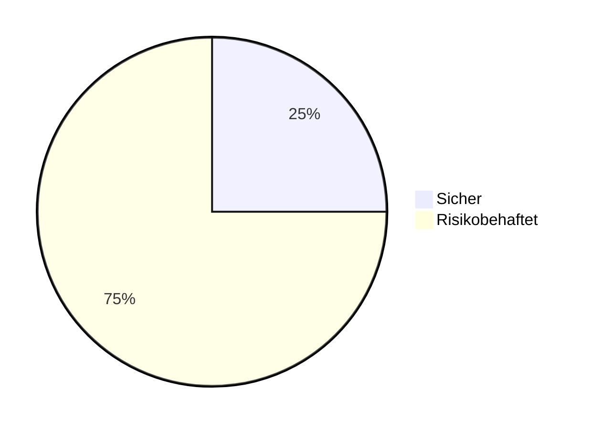
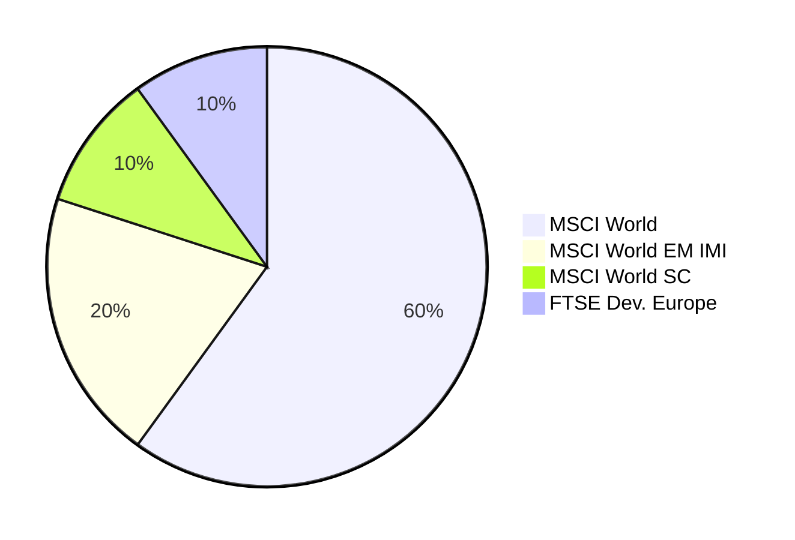

# Meine Asset Allocation / Anlagen

Dieser Beitrag zeigt meine aktuellen Asset Allocation, also das Zielbild für meinen Anlagenmix. 
Natürlich schwanken die aktuellen Werte um diese Zielprozentsätze. 
Um die Gewichtungen des aktuellen Wertes wieder in Richtung der Zielgewichtung zu bewegen ist ein regelmäßiges Rebalancing notwendig.

Die wichtigste Entscheidung ist die Wahl der Gewichtung zwischen risikobehafteten und risikofreien Anlagen. 
Ich habe mich mithilfe der Kriterien aus folgendem [Beitrag](/blog/Investment-Risikoprofil/) für diese Aufteilung entschieden:

> Bitte beachte, dass jeder eine andere Risikobereitschaft, Risikotragfähigkeit und Risikonotwendigkeit hat. Deshalb kann sich die für dich geeignete Asset-Allocation stark von meiner unterscheiden. 

## Sichere Anlagen (25%)
| Anlageform       | Produkt                                                            | TER    |
|------------------|---------------------------------------------------------------------|--------|
| Tagesgeld        | Notgroschen                                                        | 0,00%  |
| Geldmarkt ETF    | Xtrackers II EUR Overnight Rate Swap (DBX0AN)                      | 0,10%  |

Als Tagesgeldkonto nutze ich die [RenaultBank](https://www.renault-bank-direkt.de/geldanlage/produktuebersicht?werberId=NDgzNDg2). Ich weiß man bekommt dort nicht zwangsläufig den besten Zinssatz, aber ich habe dort nur meinen Notgroschen und bin kein motivierter Tagesgeldhopper. 
In den über 10 Jahren in denen ich dort Kunde bin, waren die Zinsen nie schlecht genug, dass sich für mich ein Wechsel gelohnt hätte.

> Achtung: Tagesgeld bzw. Bankeinlagen allgemein sind nur innerhalb der Einlagensicherung als sichere Anlagen zu sehen. Alles darüber hinaus ist stark risikobehaftet. Hier ein [Beitrag](https://gerd-kommer.de/risiko-von-bankguthaben/) von Gerd Kommer zum unterschätzten Risiko von Bankeinlagen.

Alles was meinen Notgroschen übersteigt investiere ich in den oben genannten [Geldmarktfond](https://gerd-kommer.de/geldmarktfonds/). Die Rendite entspricht dort recht genau dem EZB-Zins. Sollten wir uns wieder einem negativen Zinsumfeld nähern, würde ich das Geld aus dem Geldmarktfond abziehen.

## Risikobehaftete Anlagen (75%)

| Anlageform                     | Produkt                                                                           | TER    |
|--------------------------------|------------------------------------------------------------------------------------|--------|
| ETF - MSCI World               | SPDR MSCI World UCITS ETF (A2N6CW)                                                | 0,12%  |
| ETF - World Emerging Markets IMI     | iShares Core MSCI EM IMI UCITS ETF (A111X9)                                 | 0,18%  |
| ETF - MSCI World Small Cap     | iShares MSCI World Small Cap UCITS ETF (A2DWBY)                                   | 0,35%  |
| ETF - FTSE Developed Europe    | Vanguard FTSE Developed Europe UCITS ETF (A2PLBK)                                 | 0,10%  |

Hier ein paar Gedanken dazu:

- In der Spalte Produkte habe ich nur die ETFs gelistet, die ich aktuell bespare. Ich halte auch noch andere ETFs, die ich früher bespart habe und bei denen sich ein Verkauf aus steuerlichen Gründen nicht lohnt, auch wenn sie leicht höhere Verwaltungskosten haben .
- Beim Vanguard ETF auf den FTSE Developed Europe handelt es sich um den einzigen ETF der nicht aus der MSCI Indexfamilie stammt und der sich in der Zusammensetzung mit dem MSCI World überschneidet. Ich habe mich im März 2024 aktiv dazu entschieden Europa im Vergleich zur Marktkapitalisierung überzugewichten. Meine Gründe dafür waren: 
    - Leichter "Value tilt" aufgrund von niedrigeren Bewertungen in Europa
    - Den großen Anteil USA im MSCI World leicht reduzieren
    - Eine Übergewichtung der Heimatregion war historisch oft sinnvoll. (sie z.B. )
- Mit 20% Emerging Markets bin ich etwa 10% über der Marktgewichtung und 10% under einer Gewichtung nach BIP

Als Depotanbieter nutze ich [Scalable](https://de.scalable.capital/einladung/bmcvgf) und [Trade Republic](https://refnocode.trade.re/46n14kpn) wobei mit Scalable sympathischer ist.